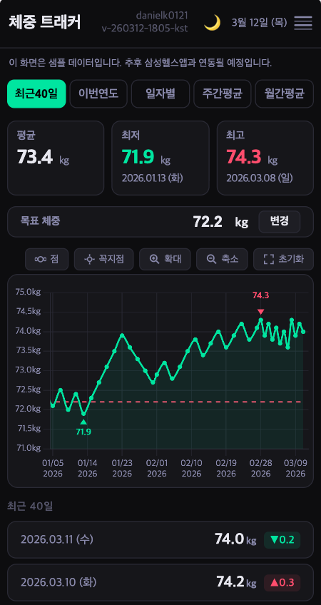
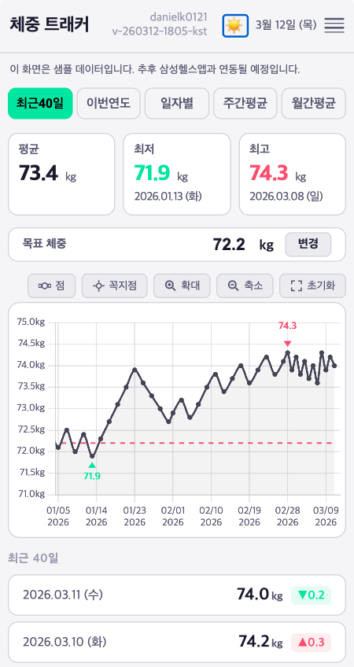

# ⚖️ MassTracker

> 삼성 헬스 체중 데이터를 코인 거래소 차트처럼 — 확대·축소·평균 분석까지

## 프로젝트 개요

MassTracker는 삼성 헬스 앱에서 내보낸 체중 데이터를 시각화하여, 사용자가 자신의 체중 변화 추세를 더 정밀하게 분석할 수 있도록 돕는 도구입니다. 

일반적인 건강 앱의 단순한 그래프를 넘어, 주식이나 코인 거래소에서 사용하는 고급 차트 기능을 체중 관리에 도입합니다.

## 주요 기능 (프로토타입)

- **캔들스틱/라인 차트**: 체중 변화를 상세하게 시각화 (현재 라인 차트 우선 구현)
- **자유로운 확대/축소 (Zoom/Pan)**: 특정 기간의 데이터를 정밀하게 확인
- **기간별 평균 자동 계산**: 선택한 범위 내의 평균 체중을 실시간으로 표시
- **반응형 웹 UI**: 모바일 환경에 최적화된 인터페이스

## 기술 스택

- **Frontend**: Vanilla JS, HTML5, CSS3
- **Chart Library**: [Chart.js](https://www.chartjs.org/) (with Zoom & Date adapters)
- **Date Handling**: [date-fns](https://date-fns.org/)

## 사용 방법

1. `prototype/weight-chart.html` 파일을 브라우저에서 엽니다.
2. 상단 탭을 통해 최근 40일, 올해, 전체 기록 등을 전환할 수 있습니다.
3. 차트 영역을 드래그하여 이동(Pan)하거나, 마우스 휠/핀치 줌을 통해 확대/축소(Zoom)할 수 있습니다.
4. 차트 하단의 목록에서 상세 기록과 전일 대비 변화량을 확인할 수 있습니다.

---

## 개발 로드맵

### Phase 1: 프로토타입 (진행 중)
- [x] 기본 라인 차트 구현
- [x] Zoom/Pan 플러그인 연동
- [x] 기간별 탭 필터링 로직
- [x] 다크/라이트 테마 지원
- [x] 목표 체중 설정 및 가이드라인 표시

### Phase 2: 삼성 헬스 연동 (예정)
- [ ] 삼성 헬스 데이터(CSV/JSON) 업로드 기능
- [ ] 데이터 파싱 및 로컬 저장 로직

---

## 스크린샷

---

## TODO 분석

### 1. 차트 유용성 재검토

현재 탭: 최근15일 / 올해 / 전체보기 / 주간평균 / 월간평균 — 5개.
- 데이터 포인트가 너무 많으면 로딩 속도와 가독성이 떨어짐.
- **해결책**:
  - ✅ **데이터 샘플링 (thinning)** — 화면에 보이는 포인트 수 기준으로 N개마다 하나만 표시
  - ✅ **최저/최고점만 항상 표시** — 기본 뷰에서 최저(↑ 초록)·최고(↓ 빨강) 마커 자동 표시, 나머지는 꼭지점 버튼으로 토글

### 2. 코인 거래소 차트, 다른 몸무게 차트 분석

벤치마킹 대상:
- **코인 거래소 (업비트, 바이낸스)** — 캔들차트, 자유 줌, 이동평균선 오버레이, 기간 프리셋 (1일/1주/1달/3달/1년/전체)
- 코인 거래소 차트, 다른 몸무게 차트 분석 필요
- 트레이딩뷰 차트를 꼭 사용할 필요는 없음

---

