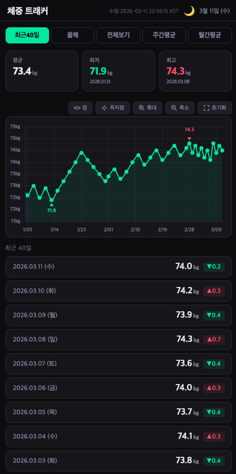
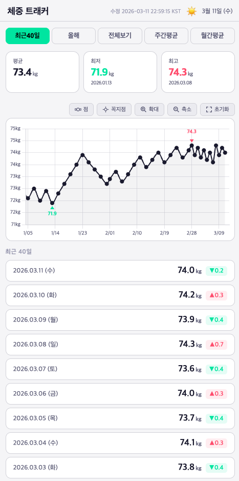

# ⚖️ MassTracker

> 삼성 헬스 체중 데이터를 코인 거래소 차트처럼 — 확대·축소·평균 분석까지


---

## 📌 프로젝트 개요

삼성 헬스의 체중 차트는 7일 / 31일 / 12개월 고정 뷰만 제공하며, 확대·축소나 꼭지점 수치 표시 같은 세부 기능이 부족합니다.

**MassTracker**는 삼성 헬스에서 체중 데이터를 직접 읽어와 트레이딩 차트(코인 거래소) 수준의 인터랙션으로 시각화하는 Android 앱입니다.

---

## 🎯 핵심 목표

| 목표 | 설명 |
|------|------|
| 삼성 헬스 연동 | Samsung Health SDK로 체중 데이터 직접 읽기 |
| 트레이딩 차트 UX | 핀치 줌, 드래그 스크롤, 자연스러운 확대·축소 |
| 다중 집계 뷰 | 일별 / 주간 평균 / 월간 평균 전환 |
| 꼭지점 수치 표시 | 그래프 각 점에 체중 숫자 ON/OFF |

---

## 📱 주요 기능

### 차트 뷰 모드

| 모드 | 설명 |
|------|------|
| **7일** | 최근 7일 일별 체중 |
| **주간 평균** | 주 단위 평균 체중 꺾은선 |
| **월간 평균** | 월 단위 평균 체중 꺾은선 |
| **전체** | 전체 기간 일별 데이터 |

### 차트 인터랙션

- **차트 패닝 (TradingView 스타일)** — 좌우 드래그로 전체 기록 자유 탐색
  - 각 탭은 해당 기간을 초기 뷰로 설정하고, 좌우 드래그 시 과거·최근 데이터로 자유 이동
  - 현재 보이는 범위에 맞춰 요약 통계·데이터 목록 실시간 업데이트
  - 마우스 드래그 / 모바일 한 손가락 스와이프 모두 지원
- **핀치 줌** — 두 손가락으로 시간 범위 확대·축소
- **드래그 스크롤** — 좌우 슬라이드로 기간 이동
- **줌 초기화** — 현재 탭의 기본 뷰로 한 번에 복귀
- **크로스헤어** — 터치한 날짜의 체중 툴팁 표시

### 데이터 표시

- 차트에 **최저값(↑ 초록)·최고값(↓ 빨강) 마커 기본 표시** — 뷰가 바뀌어도 항상 표시
- 꺾은선 그래프 꼭지점에 전체 체중 숫자 표시 (ON / OFF 토글, 기본 OFF)
- 현재 뷰 기준 **평균 / 최저 / 최고** 요약 카드
- 날짜별 목록 + 전일 대비 **증감 표시** (▲ 빨강 / ▼ 초록)

### 데이터 입력

- 앱 내 체중 직접 입력 (FAB 버튼)
- 삼성 헬스 데이터와 병합

---

## 🏗️ 기술 스택

### Phase 1 — 웹앱 프로토타입 ✅

| 항목 | 내용 |
|------|------|
| 구현체 | 단일 HTML 파일 |
| 차트 라이브러리 | [Chart.js](https://www.chartjs.org/) v4 + chartjs-plugin-zoom v2 |
| 데이터 | 더미 데이터 (JSON 배열) |
| 목적 | UI/UX 검증, 차트 인터랙션 설계 |

### Phase 2 — Android 앱 전환 🔜

| 항목 | 내용 |
|------|------|
| 언어 | Kotlin |
| 빌드 | Gradle Kotlin DSL |
| 패키지명 | `dev.danielk.masstracker` |
| 최소 SDK | Android 8.0 (API 26) |
| 차트 | MPAndroidChart 또는 WebView + Lightweight Charts |
| 삼성 헬스 연동 | Samsung Health SDK (Health Data Store) |
| 아키텍처 | MVVM + Repository 패턴 |

---

## 🔗 삼성 헬스 연동 계획

```
Samsung Health SDK
  └─ HealthDataStore.connectService()
       └─ HealthDataResolver.read(WeightMeasurement)
            └─ 날짜 / 체중(kg) 파싱
                 └─ Repository → ViewModel → Chart UI
```

- 권한: `com.samsung.android.providers.health.permission.READ`
- 데이터 타입: `com.samsung.health.weight`
- 읽기 항목: `start_time`, `weight` (kg)

---

## 📂 프로젝트 구조 (Android 전환 후)

```
masstracker/
├── app/
│   ├── src/main/
│   │   ├── java/dev/danielk/masstracker/
│   │   │   ├── data/
│   │   │   │   ├── SamsungHealthRepository.kt   # 삼성 헬스 데이터 읽기
│   │   │   │   └── WeightEntry.kt               # 데이터 모델
│   │   │   ├── ui/
│   │   │   │   ├── chart/
│   │   │   │   │   ├── ChartFragment.kt          # 메인 차트 화면
│   │   │   │   │   └── ChartViewModel.kt         # 집계 로직
│   │   │   │   └── MainActivity.kt
│   │   │   └── util/
│   │   │       └── WeightAggregator.kt           # 주간/월간 평균 계산
│   │   └── res/
│   └── build.gradle.kts
├── prototype/
│   └── weight-chart.html                         # Phase 1 웹 프로토타입
└── README.md
```

---

## 🗺️ 개발 로드맵

```
Phase 1  [완료] 웹 프로토타입
          └─ HTML + Lightweight Charts
          └─ 더미 데이터로 차트 UX 설계
          └─ 7일 / 주간 / 월간 / 전체 뷰 구현

Phase 2  [예정] Android 앱 기반 구축
          └─ Kotlin + MVVM 프로젝트 세팅
          └─ 차트 라이브러리 선정 및 통합
          └─ 더미 데이터로 Android UI 구현

Phase 3  [예정] 삼성 헬스 SDK 연동
          └─ HealthDataStore 연결
          └─ 체중 데이터 읽기 권한 처리
          └─ 실데이터 → 차트 연동

Phase 4  [예정] 기능 고도화
          └─ 목표 체중 기준선 표시
          └─ 체지방률 / BMI 병행 표시
          └─ 데이터 내보내기 (CSV)
```

---

## 📸 스크린샷

> 웹 프로토타입 (Phase 1)




---

## 🚀 실행 방법

### 웹 프로토타입

```bash
# 별도 설치 없이 브라우저에서 바로 실행
open prototype/weight-chart.html
```

### Android 앱 (Phase 2 이후)

```bash
git clone https://github.com/danielk/masstracker.git
cd masstracker
./gradlew assembleDebug
```

> 삼성 헬스가 설치된 Galaxy 기기에서 실행 필요

---

## 📋 개발 규칙

### 프로토타입 파일 수정 시

`prototype/weight-chart.html`을 수정할 때마다 헤더의 **마지막 수정 날짜를 반드시 갱신**한다.

```html
<!-- 헤더 내 날짜 문자열 — 항상 실제 수정 일시(KST)로 업데이트 -->
<span style="font-size:11px;color:var(--text3);">수정 YYYY-MM-DD HH:MM:SS KST</span>
```

현재 날짜·시각(KST)은 `TZ='Asia/Seoul' date '+%Y-%m-%d %H:%M:%S'` 명령으로 확인한다.

> 시스템 시간이 UTC 기준이므로, 반드시 `TZ='Asia/Seoul'`을 붙여 KST(UTC+9)로 변환한다.

---

## 🐛 버그 수정 이력

### 2026-03-11: 수정 시각 표시 UTC → KST 전환

헤더에 표시되는 파일 수정 시각이 UTC 기준으로 표시되던 문제를 수정했다.

| 항목 | 변경 전 | 변경 후 |
|------|---------|---------|
| 시각 표시 | `수정 YYYY-MM-DD HH:MM:SS` (UTC) | `수정 YYYY-MM-DD HH:MM:SS KST` (UTC+9) |
| 날짜 명령 | `date '+%Y-%m-%d %H:%M:%S'` | `TZ='Asia/Seoul' date '+%Y-%m-%d %H:%M:%S'` |

---

### 2026-03-11: 차트 줌/패닝/최소최대 표시 복구

TradingView(Lightweight Charts)에서 Chart.js로 전환하면서 아래 3가지 기능이 동작하지 않았던 문제 수정:

| 기능 | 원인 | 수정 내용 |
|------|------|-----------|
| **차트 확대/축소 (핀치 줌, 마우스 휠)** | `.chart-container`의 `touch-action: pan-y` 설정으로 브라우저가 터치 이벤트를 가로채 chartjs-plugin-zoom이 핀치 줌을 처리하지 못함 | `touch-action: none`으로 변경하여 차트 영역 내 모든 터치 이벤트를 Chart.js 줌 플러그인이 처리하도록 수정 |
| **차트 좌우 이동 (패닝)** | 동일한 `touch-action: pan-y` 문제로 모바일에서 수평 드래그가 간헐적으로 무시됨 | `touch-action: none`으로 수평/수직 모든 터치 제스처를 플러그인에 위임 |
| **최대값/최소값 표시** | `minMaxLabelPlugin`이 전체 데이터셋에서 min/max를 계산하여, 줌 인 상태에서 해당 포인트가 화면 밖에 위치하면 마커가 보이지 않음 | 현재 보이는 X축 범위(`chart.scales.x.min/max`) 내의 데이터만 필터링하여 min/max를 계산하도록 수정 |

---

## TODO

- 차트 유용성 재검토 : 기간 설정과 차트에 한번에 보여지는 데이터가 유용한 차트 데이터인지 재검토
- 차트 꼭지점 데이터 재검토 : 차트 꼭지점에 너무 많은 숫자가 표시되면 차트를 가리는 문제
- 코인 거래소 차트, 다른 몸무게 차트 분석 필요
- 트레이딩뷰 차트를 꼭 사용할 필요는 없음

---

## TODO 분석

### 1. 차트 유용성 재검토

현재 탭: 최근15일 / 올해 / 전체보기 / 주간평균 / 월간평균 — 5개.

각 탭의 데이터 양과 기간 범위가 극단적으로 다름. "전체보기"는 2년치 300+ 포인트를 한 화면에 밀어넣어 세부 변화가 안 보이고, "최근15일"은 너무 짧아 추세 파악이 어려움. 코인 거래소처럼 핀치 줌 + 드래그로 자유롭게 탐색하는 게 핵심이라면, 고정 기간 탭보다 **자유 줌 + 기간 프리셋 버튼** 조합이 더 효과적일 수 있음.

### 2. 차트 꼭지점 데이터 재검토

현재 꼭지점은 기본 OFF + 토글 방식이라 큰 문제는 아님. 하지만 ON 상태에서 전체보기(300+개)로 보면 숫자가 겹쳐서 읽을 수 없음.

개선 방향:
- **줌 레벨 기반 자동 간솔(thinning)** — 화면에 보이는 포인트 수 기준으로 N개마다 하나만 표시
- ✅ **최저/최고점만 항상 표시** — 기본 뷰에서 최저(↑ 초록)·최고(↓ 빨강) 마커 자동 표시, 나머지는 꼭지점 버튼으로 토글

### 3. 코인 거래소 차트, 다른 몸무게 차트 분석

벤치마킹 대상:
- **코인 거래소 (업비트, 바이낸스)** — 캔들차트, 자유 줌, 이동평균선 오버레이, 기간 프리셋 (1일/1주/1달/3달/1년/전체)
- **삼성헬스** — 7일/31일/12개월 고정 뷰, 단순 꺾은선
- **Withings/Fitbit** — 체중 차트에 목표선, 추세선(이동평균) 오버레이

현재 프로토타입은 삼성헬스보다 나은 수준이지만, 코인 거래소 수준의 인터랙션(자유 줌+스크롤)은 Lightweight Charts로 이미 지원 중. 부족한 건 **이동평균선, 목표선 같은 오버레이 요소**.

### 4. 트레이딩뷰 차트 대안 검토

Lightweight Charts는 금융 차트용이라 체중 데이터에 불필요한 기능(캔들, 볼륨)이 있고, 반대로 체중에 필요한 기능(목표선, BMI 밴드)은 없음.

대안:
- **Chart.js + zoom plugin** — 더 가볍고 커스터마이징 자유도 높음
- **Android 전환 시 MPAndroidChart** — 네이티브 성능, 핀치줌 지원
- **현재 유지** — Phase 2(Android)에서 어차피 교체할 예정이라면 프로토타입 단계에선 Lightweight Charts 유지가 합리적

---

### 작업 계획: GEMINI.md 개발 사이클 규칙 고도화 (v2)
- **목적**: 커밋 해시 기록 절차를 명확히 하여 개발 이력의 추적성을 높임.
- **수정 내용**: 
  - 커밋 후 해시 코드를 `README.md`에 기록한 뒤, **다시 한번 커밋 및 푸시**하는 절차를 명시함.
- **예상 결과**: PR에 포함된 최종 커밋에서 해당 작업의 계획과 해시를 한꺼번에 확인할 수 있음.

---

### 작업 계획: 라이트 모드 차트 색상 블랙/화이트 톤으로 변경
- **목적**: 라이트 모드에서 차트의 시인성을 높이고 깔끔한 미니멀 디자인을 구현하기 위해 기존 초록색 톤을 블랙/화이트 톤으로 변경함.
- **수정 내용**: 
  - `prototype/weight-chart.html`의 `toggleTheme` 함수 수정.
  - 라이트 모드일 때 차트 선 색상(`borderColor`), 포인트 색상, 배경 채우기 색상을 블랙 계열로 변경.
  - 다크 모드에서는 기존 초록색 유지.
- **예상 결과**: 라이트 모드에서 차트가 더 차분하고 고급스러운 블랙/화이트 톤으로 표시됨.

---

### 작업 계획: GEMINI.md 개발 사이클 규칙 단순화 (v3)
- **목적**: 작업 효율을 위해 번거로운 해시 기록 및 재커밋 절차를 제거함.
- **수정 내용**: 
  - 커밋 후 해시를 `README.md`에 기록하고 다시 푸시하는 단계(이전 5번 규칙의 세부 사항)를 제거.
- **예상 결과**: 작업 사이클이 더 빨라지고 간결해짐.

---

### 작업 계획: 꺾은선 그래프 점(마커) 추가
- **목적**: 차트의 시독성을 높이기 위해 데이터 포인트마다 점(마커)을 표시함.
- **수정 내용**: 
  - `prototype/weight-chart.html` 내 Chart.js 설정 중 `pointRadius`를 0에서 3으로 변경.
  - 마우스 오버 시 마커 크기(`pointHoverRadius`)를 적절히 조정.
- **예상 결과**: 각 데이터 포인트의 위치가 명확하게 표시되어 데이터 확인이 용이해짐.

---

### 작업 계획: GEMINI.md 브랜치 생성 전 최신 main 동기화 규칙 추가
- **목적**: 작업 시작 시 항상 최신 코드를 기반으로 하여 충돌을 방지하고 코드의 일관성을 유지함.
- **수정 내용**: 
  - `GEMINI.md`의 1번 규칙(브랜치 생성)에 `checkout main`, `fetch`, `pull` 단계를 명시함.
- **예상 결과**: 모든 신규 작업이 원격의 최신 상태를 반영한 안전한 환경에서 시작됨.

---

### 작업 계획: 라이트 모드 차트 꺾은선 색상 톤 하향
- **목적**: 라이트 모드에서 차트 선이 너무 진한 검은색으로 보여 부담스러운 점을 개선하고, 시각적으로 더 부드러운 느낌을 주기 위해 톤을 낮춤.
- **수정 내용**: 
  - `prototype/weight-chart.html`의 `THEME.light.line` 색상을 `#1a1a2e`에서 좀 더 옅은 검은색(회색 톤)인 `#444455`로 변경.
- **예상 결과**: 라이트 모드에서 차트가 이전보다 눈이 편안하고 부드러운 톤으로 표시됨.

---

### 작업 계획: 차트 X축 연도 표시 추가
- **목적**: 데이터의 시점이 어느 연도인지 명확히 알 수 있도록 X축 날짜 포맷에 연도를 포함함.
- **수정 내용**: 
  - `prototype/weight-chart.html`의 Chart.js 설정 중 `scales.x.time.displayFormats.day` 값을 `'MM/dd'`에서 `'yy/MM/dd'`로 변경.
- **예상 결과**: 차트 하단 날짜 표시에서 연도(yy)를 함께 확인할 수 있게 됨.

---

### 작업 계획: 차트 X축 날짜 두 줄 표시 (MM/dd + yyyy)
- **목적**: 날짜 시인성을 높이기 위해 월/일과 연도를 두 줄로 분리하여 표시함.
- **수정 내용**: 
  - `prototype/weight-chart.html`의 Chart.js `scales.x.ticks.callback`을 추가하여 `[월/일, 연도]` 배열을 반환하도록 수정.
- **예상 결과**: 차트 X축 라벨이 상단에 'MM/dd', 하단에 'yyyy'가 배치된 두 줄 형태로 표시됨.


