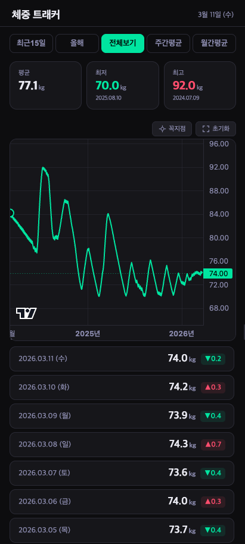

# ⚖️ MassTracker

> 삼성 헬스 체중 데이터를 코인 거래소 차트처럼 — 확대·축소·평균 분석까지


---

## 📌 프로젝트 개요

삼성 헬스의 체중 차트는 7일 / 31일 / 12개월 고정 뷰만 제공하며, 확대·축소나 꼭지점 수치 표시 같은 세부 기능이 부족합니다.

**MassTracker**는 삼성 헬스에서 체중 데이터를 직접 읽어와 트레이딩 차트(코인 거래소) 수준의 인터랙션으로 시각화하는 Android 앱입니다.

---

## 🎯 핵심 목표

| 목표 | 설명 |
|------|------|
| 삼성 헬스 연동 | Samsung Health SDK로 체중 데이터 직접 읽기 |
| 트레이딩 차트 UX | 핀치 줌, 드래그 스크롤, 자연스러운 확대·축소 |
| 다중 집계 뷰 | 일별 / 주간 평균 / 월간 평균 전환 |
| 꼭지점 수치 표시 | 그래프 각 점에 체중 숫자 ON/OFF |

---

## 📱 주요 기능

### 차트 뷰 모드

| 모드 | 설명 |
|------|------|
| **7일** | 최근 7일 일별 체중 |
| **주간 평균** | 주 단위 평균 체중 꺾은선 |
| **월간 평균** | 월 단위 평균 체중 꺾은선 |
| **전체** | 전체 기간 일별 데이터 |

### 차트 인터랙션

- **핀치 줌** — 두 손가락으로 시간 범위 확대·축소
- **드래그 스크롤** — 좌우 슬라이드로 기간 이동
- **줌 초기화** — 전체 범위로 한 번에 복귀
- **크로스헤어** — 터치한 날짜의 체중 툴팁 표시

### 데이터 표시

- 꺾은선 그래프 꼭지점에 체중 숫자 표시 (ON / OFF 토글)
- 현재 뷰 기준 **평균 / 최저 / 최고** 요약 카드
- 날짜별 목록 + 전일 대비 **증감 표시** (▲ 빨강 / ▼ 초록)

### 데이터 입력

- 앱 내 체중 직접 입력 (FAB 버튼)
- 삼성 헬스 데이터와 병합

---

## 🏗️ 기술 스택

### Phase 1 — 웹앱 프로토타입 ✅

| 항목 | 내용 |
|------|------|
| 구현체 | 단일 HTML 파일 |
| 차트 라이브러리 | [TradingView Lightweight Charts](https://github.com/tradingview/lightweight-charts) v4 |
| 데이터 | 더미 데이터 (JSON 배열) |
| 목적 | UI/UX 검증, 차트 인터랙션 설계 |

### Phase 2 — Android 앱 전환 🔜

| 항목 | 내용 |
|------|------|
| 언어 | Kotlin |
| 빌드 | Gradle Kotlin DSL |
| 패키지명 | `dev.danielk.masstracker` |
| 최소 SDK | Android 8.0 (API 26) |
| 차트 | MPAndroidChart 또는 WebView + Lightweight Charts |
| 삼성 헬스 연동 | Samsung Health SDK (Health Data Store) |
| 아키텍처 | MVVM + Repository 패턴 |

---

## 🔗 삼성 헬스 연동 계획

```
Samsung Health SDK
  └─ HealthDataStore.connectService()
       └─ HealthDataResolver.read(WeightMeasurement)
            └─ 날짜 / 체중(kg) 파싱
                 └─ Repository → ViewModel → Chart UI
```

- 권한: `com.samsung.android.providers.health.permission.READ`
- 데이터 타입: `com.samsung.health.weight`
- 읽기 항목: `start_time`, `weight` (kg)

---

## 📂 프로젝트 구조 (Android 전환 후)

```
masstracker/
├── app/
│   ├── src/main/
│   │   ├── java/dev/danielk/masstracker/
│   │   │   ├── data/
│   │   │   │   ├── SamsungHealthRepository.kt   # 삼성 헬스 데이터 읽기
│   │   │   │   └── WeightEntry.kt               # 데이터 모델
│   │   │   ├── ui/
│   │   │   │   ├── chart/
│   │   │   │   │   ├── ChartFragment.kt          # 메인 차트 화면
│   │   │   │   │   └── ChartViewModel.kt         # 집계 로직
│   │   │   │   └── MainActivity.kt
│   │   │   └── util/
│   │   │       └── WeightAggregator.kt           # 주간/월간 평균 계산
│   │   └── res/
│   └── build.gradle.kts
├── prototype/
│   └── weight-chart.html                         # Phase 1 웹 프로토타입
└── README.md
```

---

## 🗺️ 개발 로드맵

```
Phase 1  [완료] 웹 프로토타입
          └─ HTML + Lightweight Charts
          └─ 더미 데이터로 차트 UX 설계
          └─ 7일 / 주간 / 월간 / 전체 뷰 구현

Phase 2  [예정] Android 앱 기반 구축
          └─ Kotlin + MVVM 프로젝트 세팅
          └─ 차트 라이브러리 선정 및 통합
          └─ 더미 데이터로 Android UI 구현

Phase 3  [예정] 삼성 헬스 SDK 연동
          └─ HealthDataStore 연결
          └─ 체중 데이터 읽기 권한 처리
          └─ 실데이터 → 차트 연동

Phase 4  [예정] 기능 고도화
          └─ 목표 체중 기준선 표시
          └─ 체지방률 / BMI 병행 표시
          └─ 데이터 내보내기 (CSV)
```

---

## 📸 스크린샷

> 웹 프로토타입 (Phase 1)



---

## 🚀 실행 방법

### 웹 프로토타입

```bash
# 별도 설치 없이 브라우저에서 바로 실행
open prototype/weight-chart.html
```

### Android 앱 (Phase 2 이후)

```bash
git clone https://github.com/danielk/masstracker.git
cd masstracker
./gradlew assembleDebug
```

> 삼성 헬스가 설치된 Galaxy 기기에서 실행 필요

---

## TODO

- 차트 유용성 재검토 : 기간 설정과 차트에 한번에 보여지는 데이터가 유용한 차트 데이터인지 재검토
- 차트 꼭지점 데이터 재검토 : 차트 꼭지점에 너무 많은 숫자가 표시되면 차트를 가리는 문제
- 코인 거래소 차트, 다른 몸무게 차트 분석 필요
- 트레이딩뷰 차트를 꼭 사용할 필요는 없음


