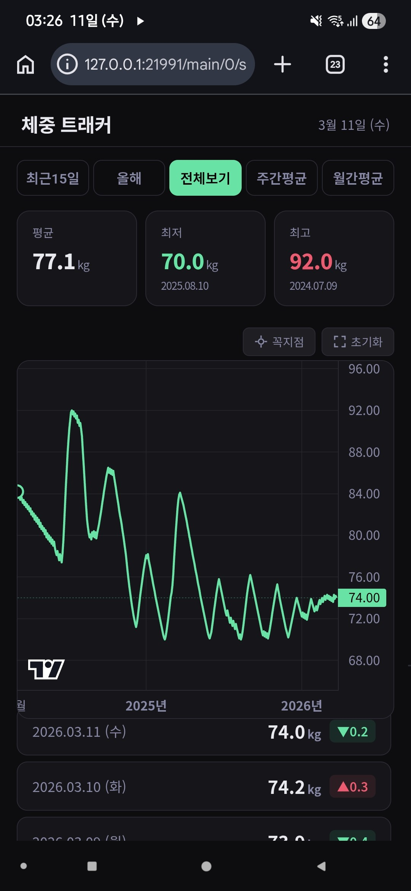

> 아래 이슈는 2026-03-11 모바일(Android) 실기기 테스트에서 발견됨

### 이슈 1 — 차트 높이가 너무 커서 목록 영역이 가려짐

**증상**
- 차트 컴포넌트가 화면 대부분을 차지해 하단 날짜별 목록이 있는지조차 인지하기 어려움
- 사용자가 목록 존재를 모르고 지나칠 수 있음

**수정 방향**
- 차트 높이를 줄여 목록 영역이 초기 화면에서 일부 보이도록 조정

---

### 이슈 2 — 모바일 스크롤 시 차트가 상단 고정처럼 동작

**증상**
- 폰에서 손가락으로 스크롤할 때 목록 영역만 스크롤되고 차트는 화면 상단에 고정된 것처럼 움직이지 않음
- 전체 페이지가 위아래로 스크롤되어야 하는데, 차트 아래의 콘텐츠만 스크롤되는 것처럼 보임
- 사용자 입장에서 차트가 sticky/fixed 처리된 것과 동일한 경험

**수정 방향**
- 차트 영역이 터치 이벤트를 독점해 상위 스크롤을 막는 것이 원인으로 추정
- 차트 내 드래그(좌우 탐색)와 페이지 스크롤(상하)이 구분되도록 이벤트 처리 수정 필요
- `touch-action` CSS 속성 또는 Lightweight Charts의 터치 이벤트 핸들링 검토
